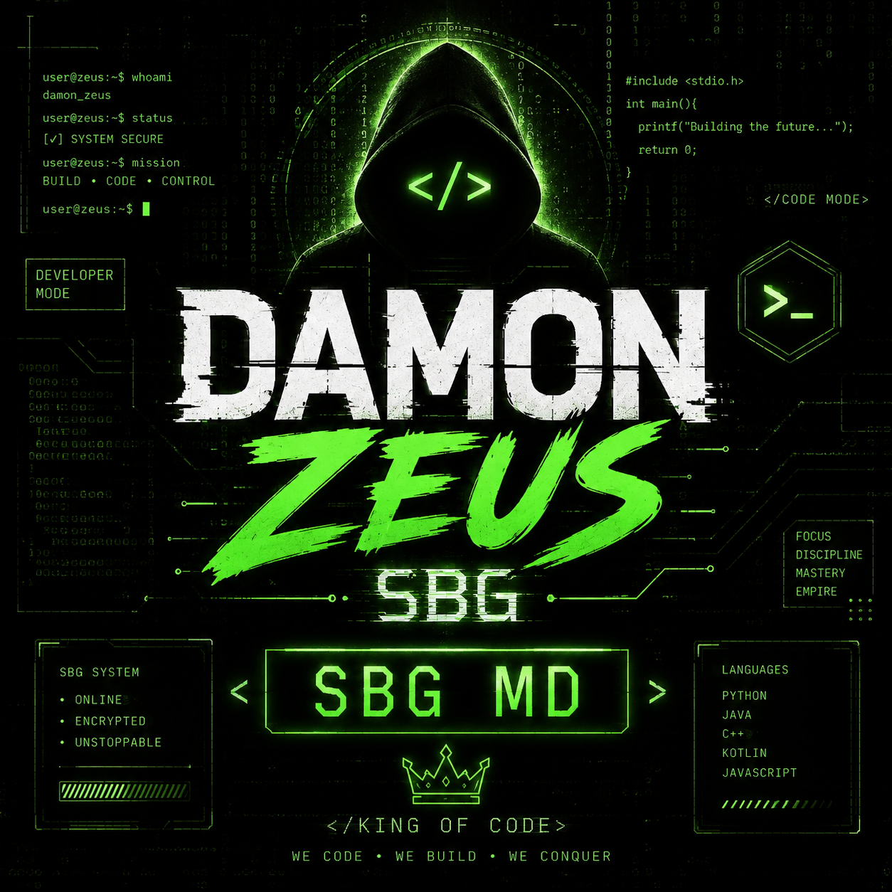

<p align="center">
  
</p>
<div align="center">

# ⚡ DARKSEID SYSTEM ⚡

### `DEVELOPER • CODE ARCHITECT • AUTOMATION • CYBERSECURITY`


<br>

<a href="https://github.com/darkseid-system">

</a>
# 🔐 SBG-MD SESSION GENERATOR
<p align="center">
  
</p>

<div align="center">

# ⚡ DARKSEID SYSTEM ⚡

### `DEVELOPER • CODE ARCHITECT • AUTOMATION • CYBERSECURITY`


<br>

<a href="https://github.com/darkseid-system">

</a>

<a href="https://github.com/darkseid-system/SBG-MD">

</a>

<a href="https://youtube.com/@darkseidtech">

</a>

<a href="https://t.me/DARKSEID_COMPANY">

</a>

<br><br>


</div>

---

# 👨‍💻 À PROPOS DE MOI

```text
╔══════════════════════════════════════════════════╗
║              DARKSEID SYSTEM                     ║
╠══════════════════════════════════════════════════╣
║ 👤 Role       : Developer & Code Architect       ║
║ ⚡ Focus      : Software & Automation            ║
║ 🤖 Specialty  : Bots & Digital Systems           ║
║ 🌐 Web        : APIs & Backend Development       ║
║ 🔐 Security   : Cybersecurity & Research         ║
║ 🧠 Mindset    : Learn • Build • Secure           ║
╚══════════════════════════════════════════════════╝

<a href="https://github.com/darkseid-system/SBG-MD">

</a>

<a href="https://youtube.com/@darkseidtech">

</a>

<a href="https://t.me/DARKSEID_COMPANY">

</a>

<br><br>
---

<div align="center">

# ⚡ SBG-MD ⚡

### `NEXT-GENERATION WHATSAPP BOT`


<br>


</div>

---

# 🌀 INITIALIZE SBG-MD
# ⚡ INITIALISEUR SBG-MD

<p align="center">

<a href="https://github.com/darkseid-system/SBG-MD/fork">

</a>

<br><br>

<a href="https://github.com/darkseid-system/SBG-MD">

</a>

<br><br>

<a href="https://VOTRE-DOMAINE-RENDER.onrender.com/session">

</a>

<br><br>

<a href="https://render.com/deploy?repo=https://github.com/darkseid-system/SBG-MD">

</a>

</p>

---

# ⚡ SYSTÈME DE DÉPLOIEMENT SBG-MD

```text
╔══════════════════════════════════════════════╗
║              DARKSEID SYSTEM                 ║
╠══════════════════════════════════════════════╣
║                                              ║
║  1] 🍴 FORK REPOSITORY                       ║
║                                              ║
║  2] 🔐 GÉNÉRER UNE SESSION                   ║
║                                              ║
║  3] 🚀 DEPLOY SBG-MD                         ║
║                                              ║
║  4] ⚙️ CONFIGURER LES VARIABLES              ║
║                                              ║
║  5] 🤖 DÉMARRER LE BOT                       ║
║                                              ║
╚══════════════════════════════════════════════╝
.github/workflows/bot.yml
name: SBG-MD Bot

on:
  workflow_dispatch:
  push:
    branches:
      - main

jobs:
  build:
    runs-on: ubuntu-latest

    strategy:
      matrix:
        node-version: [20.x]

    steps:
      - name: Checkout repository
        uses: actions/checkout@v4

      - name: Set up Node.js
        uses: actions/setup-node@v4
        with:
          node-version: ${{ matrix.node-version }}
          cache: npm

      - name: Install dependencies
        run: npm install

      - name: Check JavaScript syntax
        run: |
          node --check index.js
          node --check setting.js
          node --check lib/bot.js
          node --check lib/command.js
          node --check lib/functions.js
          node --check lib/msg.js
          node --check lib/status.js

      - name: Start SBG-MD
        run: npm start
        env:
          SESSION_ID: ${{ secrets.SESSION_ID }}
          OWNER_NUMBER: ${{ secrets.OWNER_NUMBER }}
          OWNER_NAME: ${{ secrets.OWNER_NAME }}
          BOT_NAME: SBG-MD
          STICKER_NAME: SBG-MD
          PREFIX: .
          MODE: private
          PUBLIC_MODE: false


</div>

---

# 👨‍💻 À PROPOS DE MOI

```text
╔══════════════════════════════════════════════════╗
║              DARKSEID SYSTEM                     ║
╠══════════════════════════════════════════════════╣
║ 👤 Role       : Developer & Code Architect       ║
║ ⚡ Focus      : Software & Automation            ║
║ 🤖 Specialty  : Bots & Digital Systems           ║
║ 🌐 Web        : APIs & Backend Development       ║
║ 🔐 Security   : Cybersecurity & Research         ║
║ 🧠 Mindset    : Learn • Build • Secure           ║
╚══════════════════════════════════════════════════╝
    alias: "DARKSEID SYSTEM",
    role: "Developer & Code Architect",
    mission: "Turning ideas into powerful digital systems",

    focus: [
        "Software Development",
        "Cybersecurity",
        "Ethical Hacking",
        "Automation",
        "Open Source"
    ],

    languages: ["JavaScript", "TypeScript", "Python"],
    technologies: ["Node.js", "APIs", "Web Development", "Git", "GitHub"],

    mindset: "Learn • Build • Secure • Automate",
    motto: "Code is the tool. Knowledge is the power."
};
